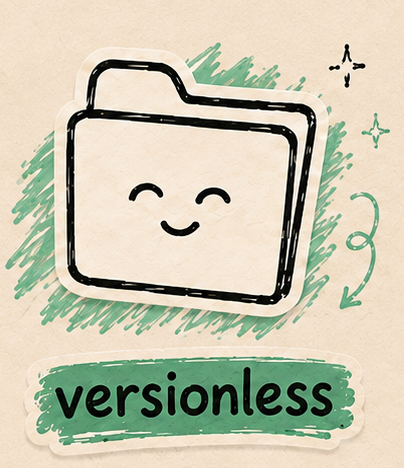

<p align="center">
  
</p>

# versionless

Migrate old React and Angular apps to modern stacks, and *prove* the migrated app still behaves like the original.

## What is this?

So, here's a situation you've probably seen (or inherited): an app that works fine, but it's pinned to React 16, or Angular 8, or a webpack version from another era. Nobody wants to touch it. Every "just upgrade it" attempt turns into a month of whack-a-mole.

versionless is a toolkit for exactly that app. You point one command at it, and versionless does three things:

1. **Reads** the app: what framework, what version, what builder, what era of Node it expects.
2. **Rewrites** it into a separate folder (called a *lane*). It never writes into your original app. Not one byte.
3. **Proves** the result. It installs, builds, and then drives *both* the old app and the new one through the same journeys in a real browser, checking that they behave the same.

That last step is the whole point. Lots of tools can rewrite code. versionless won't call a migration done until a browser has watched the migrated app act like the original.

## The one honest rule

Here's the thing that makes this project a little unusual: **versionless refuses instead of guessing.**

If it hits something it doesn't understand (a framework it has no adapter for, a lockfile from a different package manager, a dependency it has never verified), it stops and tells you by name:

```
refused: install.lockfile-foreign
```

That's not a crash. That's the tool being honest. Every refusal has a name, every name is counted, and the list of things it *won't* claim is published right next to the list of things it will.

If you've ever been burned by a tool that "succeeded" and quietly broke your app... yeah. That's the failure mode this design exists to prevent.

Some refusals can be lifted with an explicit flag. For example, `--allow-foreign-lockfile` tells it "yes, ignore the yarn lockfile and resolve fresh." But *you* make that call, out loud, and the decision is recorded in the run's receipt. Nothing is ever silently assumed on your behalf.

## Try it

Five commands, from "just look at it" to "do the whole thing":

```sh
# What is this app? (framework, version, builder, Node era. Read-only.)
node packages/cli/src/cli.ts analyze <app-root>

# What *would* you change? (composes the changeset, writes nothing)
node packages/cli/src/cli.ts plan <app-root>

# Do it: into a separate lane, never into the app itself
node packages/cli/src/cli.ts migrate <app-root> --out <lane>

# Run every offline self-check in one summary
node packages/cli/src/cli.ts verify

# What is actually supported? (the derived matrix, see below)
node packages/cli/src/cli.ts supported-matrix
```

Every command takes `--help` and `--json`. Start with `analyze`: it can't hurt anything, and it'll tell you right away whether versionless recognizes your app.

(Requires Node 24+. On older Node, add `--experimental-strip-types` after `node`.)

## What does "supported" mean here?

This part matters, so let's be really clear about it.

versionless doesn't have a marketing-page support table. It has a **generated** one. Every cell in the supported matrix is derived from receipts of real runs: a real app, really migrated, really witnessed in a browser. If it's not in the matrix, it's not supported. Unknown is reported as *unknown*, never as "probably fine."

Two documents carry the whole picture. Both are generated, never hand-edited (an edited copy fails verification instead of changing a claim):

- [`evidence/trust/current/coverage-report.md`](evidence/trust/current/coverage-report.md): every application that's been through the pipeline, and exactly how far each one got
- [`evidence/trust/current/enterprise-report.md`](evidence/trust/current/enterprise-report.md): the full evidence report, with sources, versions, hashes, journeys, results, and the claims-and-non-claims one-pager

And to be honest about where things stand today: the React line runs end to end (several real apps have gone command, to migrated, to browser-proven, with zero human intervention). The Angular line reaches the build stage and stops on a small set of known, named defects that are queued for a fix. The coverage report says exactly which apps and exactly which stages. Go look. It's the source of truth.

## A few more things it never does

- **Never touches your app.** All writes go to the lane. The tool counts its own interventions per run, and a migration only counts as *proven* if that count is zero.
- **Never phones home quietly.** Network access is opt-in and phase-scoped: fetching an app's source requires an explicit consent flag, and everything after that runs offline.
- **Never inflates its own numbers.** The trust package cross-checks every published count against the underlying receipts. Failed runs are kept forever as falsification history, right beside the successes.

## Going deeper

- [`docs/operator-flows.md`](docs/operator-flows.md): full reference for the five commands
- [`docs/evidence-program.md`](docs/evidence-program.md): the complete, unsimplified record of every proof in this repository (the lab-notebook version of this README)
- `evidence/runs/<app>/run-record.json`: the per-app receipts, one per migration attempt

Part of the same family as [frameless](https://github.com/jacksm5pro) and markless.

> **Status:** active evidence program. This is evidence, not certification. No cell is warranted, hashes establish integrity rather than authenticity, and sandboxing is process-scoped rather than OS-wide. The generated reports state every boundary precisely.
